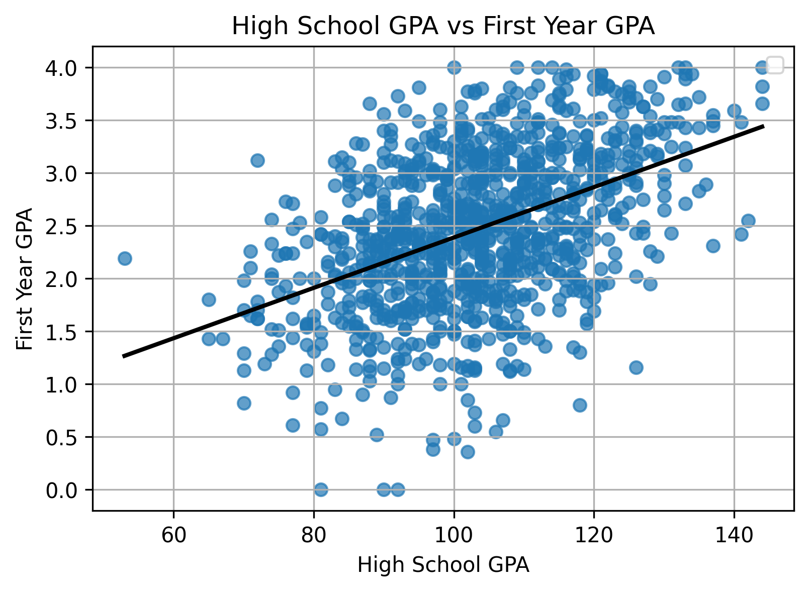

<head>

</head>

# Generalized Additive Models

The general linear regression model enables the study of relationships between quantitative variables through the linear combination of the predicted and predictor variables. It allows for simple, straightforward, and interpretable modeling with one or many predictor variables, assuming straight-line relationships. However, data collected from the real-world often show nonlinear and complex relationships between different variables. While SAT score and college GPA might be moderately positively correlated along a straight line, the relationship between temperature and those same students'demand for electricity might be anything but linear.

This blog post explores the topic of generalized additive models: a type of regression models that enable the study of nonlinear relationships between data. These models retain the interpretability of linear regression while allowing for other curve shapes, such as quadratic or logarithmic.

# The basics

## Standard linear regression model

The standard linear regression model using ordinary least squares analyzes a response variable in terms of its relation to other variables. Theses predictor variables, denoted with Xs, are multipled by the coefficients \beta and summed. The target or response variable, Y_i, is assumed to be normally distributed with mean $\mu$ and variance $\sigma^2$.

$$
Y_i = \beta_0 + \beta_1 X_{i1} + \beta_2 X_{i2} + \cdots + \beta_{p-1} X_{i,p-1} + \varepsilon_i
$$

$$
Y \sim \mathcal{N}(\mu, \sigma^2)
$$